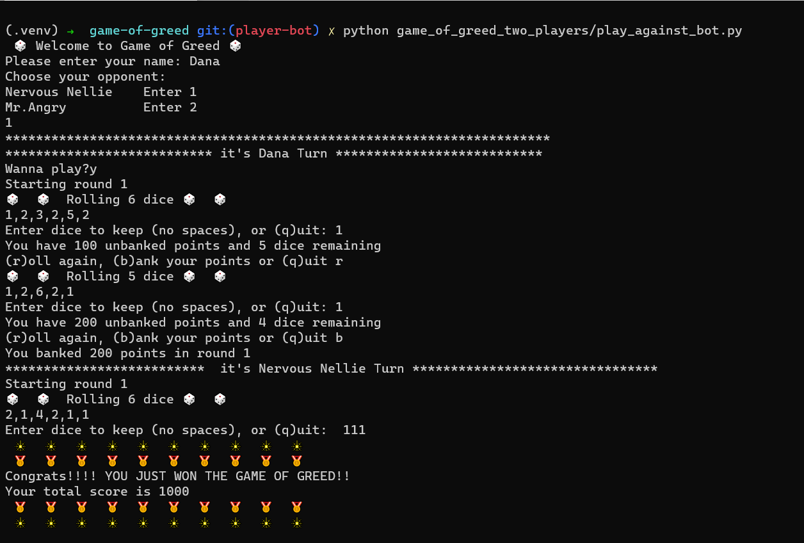

# Game of Greed

 

## Description

 

The Game of Greed, also known as 10,000, is a dice game where each player competes to be the first to reach 1000 points. Take risks, push the limit, and get greedy!!

You can play solo or play against a bot, we have two characters: Nervous Nellie and Mr.Angry. Play against them and try your best to win. 

You can play the game by running play_against_bot.py file in the terminal. 

 

____

# Collaborators:

**Dana Al-Abbade**

**Mohammad Ashabab**

**Saleh Almasri**

 

# Notes:

Full python script, for the tests we used pytest and pywatch.

